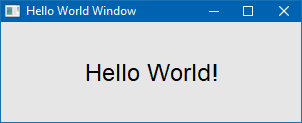
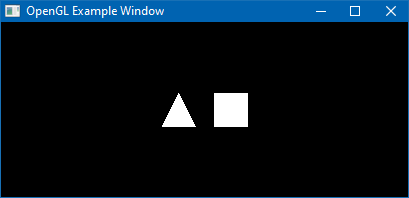
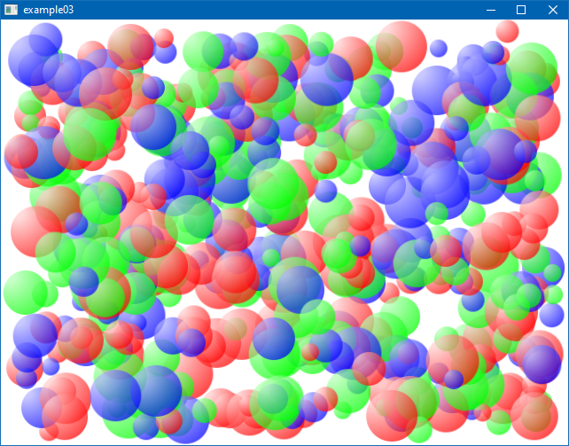
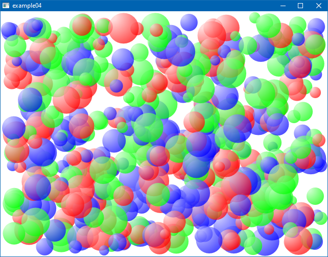
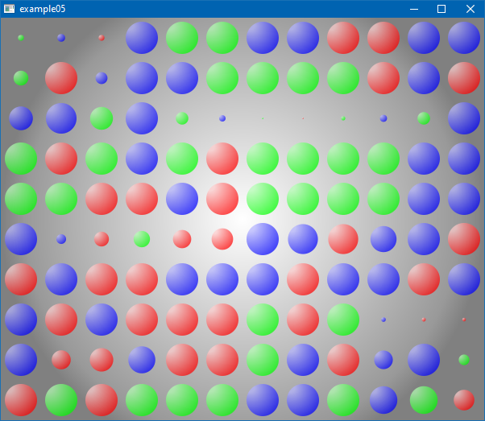

# lpugl Examples
<!-- ---------------------------------------------------------------------------------------- -->

   * [`example01.lua`](./example01.lua)
     
     Simple example using the Cairo rendering backend. The Cairo backend 
     requires [OOCairo].

     
     

<!-- ---------------------------------------------------------------------------------------- -->

   * [`example02.lua`](./example02.lua)

     Simple example using the OpenGL rendering backend. This example
     uses [LuaGL] Lua binding (see also [enhanced LuaGL rockspec]).

     

<!-- ---------------------------------------------------------------------------------------- -->

   * [`example03.lua`](./example03.lua)

     A mini game demonstrating smooth animations using pre-rendered cairo
     surfaces.

     

<!-- ---------------------------------------------------------------------------------------- -->

   * [`example04.lua`](./example04.lua)

     Same mini game as in `example03.lua` but here the OpenGL backend is used.
     This example uses [lua-nanovg] as vector graphics rendering library for OpenGL.

     

<!-- ---------------------------------------------------------------------------------------- -->

   * [`example05.lua`](./example05.lua)

     An interactive demonstration for partial redrawing using the cairo rendering backend.

     

<!-- ---------------------------------------------------------------------------------------- -->

[OOCairo]:                  https://luarocks.org/modules/osch/oocairo
[LuaGL]:                    https://luarocks.org/modules/blueowl04/opengl
[enhanced LuaGL rockspec]:  https://github.com/osch/luarocks-build-extended/blob/master/example/opengl-1.11-2.rockspec
[lua-nanovg]:               https://luarocks.org/modules/xavier-wang/nanovg

<!-- ---------------------------------------------------------------------------------------- -->
