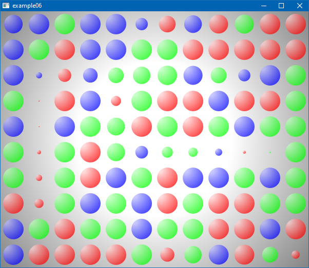
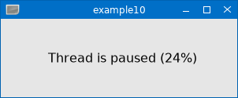

# lpugl Examples
<!-- ---------------------------------------------------------------------------------------- -->

   * [`example01.lua`](./example01.lua)
     
     Simple example using the Cairo rendering backend. The Cairo backend 
     requires [OOCairo].

     
     

<!-- ---------------------------------------------------------------------------------------- -->

   * [`example02.lua`](./example02.lua)

     Simple example using the OpenGL rendering backend. This example
     uses [LuaGL] Lua binding (see also [enhanced LuaGL rockspec]).

     

<!-- ---------------------------------------------------------------------------------------- -->

   * [`example03.lua`](./example03.lua)

     A mini game demonstrating smooth animations using pre-rendered cairo
     surfaces.

     

<!-- ---------------------------------------------------------------------------------------- -->

   * [`example04.lua`](./example04.lua)

     Same mini game as in `example03.lua` but here the OpenGL backend is used.
     This example uses [lua-nanovg] as vector graphics rendering library for OpenGL.

     

<!-- ---------------------------------------------------------------------------------------- -->

   * [`example05.lua`](./example05.lua)

     An interactive demonstration for partial redrawing using the cairo rendering backend.

     

<!-- ---------------------------------------------------------------------------------------- -->

   * [`example06.lua`](./example06.lua)

     Partial redraw demonstration similar to `example05.lua` using the OpenGL backend with
     [lua-nanovg].

     

<!-- ---------------------------------------------------------------------------------------- -->

   * [`example10.lua`](./example10.lua)

     This examples demonstrates the usage of the *Notify C API* in a multithreading scenario.
     
     LPugl world objects implement the *Notify C API*, see [src/notify_capi.h](../src/notify_capi.h),
     i.e. the world object has an an associated meta table entry *_capi_notify* delivered by
     the C API function *notify_get_capi()* and the associated C API function *toNotifier()* returns
     a valid pointer for a given LPugl world object.
     
     In this example the *Notify C API* is used to notify the event loop by calling *world:awake()*
     each time a message is added by another thread to a [mtmsg](https://github.com/osch/lua-mtmsg)
     buffer object. 
     
     This is done by connecting the LPugl world object as a notifier object to the mtmsg buffer 
     object.

     

<!-- ---------------------------------------------------------------------------------------- -->

[OOCairo]:                  https://luarocks.org/modules/osch/oocairo
[LuaGL]:                    https://luarocks.org/modules/blueowl04/opengl
[enhanced LuaGL rockspec]:  https://github.com/osch/luarocks-build-extended/blob/master/example/opengl-1.11-2.rockspec
[lua-nanovg]:               https://luarocks.org/modules/xavier-wang/nanovg

<!-- ---------------------------------------------------------------------------------------- -->
